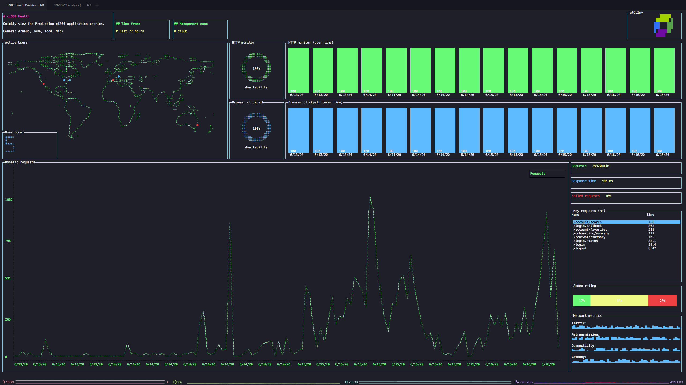

# CLI Dashboard

The CLI Dashboard was developed by the console squad as a 24 hour Dynatrace Innovation day project. The purpose of this project is to learn how to display dynamic data in the terminal with a nice styled interface. Our examples include Dynatrace metrics and covid data right in your terminal, so you can always feel like you're JP from Grandma's Boy (2006).

### Technologies used:

- [Blessed](https://github.com/chjj/blessed)
- [Dynatrace API](https://www.dynatrace.com/support/help/dynatrace-api/environment-api/metric-v2/get-all-metrics/)

### Contributors:

- Crowther, Arnaud
- Colella, Jose
- Baert, Todd
- Vogt, Nick

Live Dynatrace monitoring metrics pulled from the customer API:

Covid metrics:

